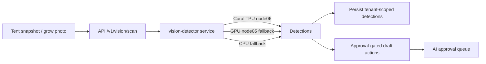

# Edge Vision Detection

Tendril can run fast, deterministic **object detection** on tent snapshots and grow
photos — localizing and counting pests, disease spots, deficiency regions, plants, buds,
and trichome states with bounding boxes. Detection is **complementary** to the existing
LLaVA/Gemini vision *reasoning*: YOLO localizes and counts, then the LLM pipeline can
reason about the relevant crops.

Detection is **optional** and degrades gracefully. If you self-host without a Coral Edge
TPU — or without deploying the detector at all — every other feature keeps working and
detection simply reports as unavailable.

## How it works



- **`vision-detector`** is a stateless microservice. It loads the active detection model
  and returns detections for a supplied image. It holds **no** database credentials — the
  API owns all persistence.
- Detections carry a class label, a confidence score (0.0–1.0), a **normalized** bounding
  box `[x, y, w, h]` (top-left corner + width/height in `[0, 1]`), the model version, and
  the accelerator tier that served the request.

## Tiered accelerator fallback

The detector selects the best available accelerator per request and records which tier
served it:

1. **Coral Edge TPU** (`node06`) — primary, int8 Edge-TPU-compiled tflite model (~2 W).
2. **GPU** (`node05`) — non-quantized ONNX model via CUDA/TensorRT when the TPU delegate
   can't initialize or the pod can't schedule on `node06`.
3. **CPU** — always-available fallback (degraded latency).

If the Coral delegate fails at request time, the service transparently falls back to the
GPU/CPU ONNX path and records the downgraded tier, so a `fallback_rate` metric rises when
`node06` degrades.

## Self-hosting without a TPU

Detection is entirely optional:

- **No detector deployed** → the API returns a graceful *"detection unavailable"* result
  and the UI shows a *"Detection is not configured"* state.
- **Detector on CPU/GPU only** → set `VISION_CORAL_ENABLED=false`; scans run on the GPU or
  CPU tier. No Coral libraries are required for these tiers — `pycoral`/`libedgetpu` are
  imported lazily and only on the Coral node.

To run the detector locally, point it at a model:

```bash
# Option A: explicit model file / storage key
VISION_MODEL_VERSION=v1 VISION_MODEL_PATH=/models/model.onnx uvicorn app.main:app --port 8080

# Option B: active-model manifest published to MinIO/S3 (see "Model registry")
VISION_MODEL_MANIFEST_KEY=vision/models/active.json uvicorn app.main:app --port 8080
```

## Model registry

The API owns a versioned `vision_model_registry` (per tenant). Activating a version writes
an `active.json` manifest to MinIO/S3 that the stateless detector reads at startup:

```json
{
  "version": "v1",
  "onnx_key": "vision/models/v1/model.onnx",
  "edge_tpu_storage_key": "vision/models/v1/model_edgetpu.tflite",
  "input_width": 640,
  "input_height": 640,
  "class_map": { "0": "pest_disease", "1": "nutrient_deficiency" }
}
```

If a published manifest is malformed or incompatible with the runtime (bad input size,
empty class map), the detector **refuses** it, keeps the previously active model in
service, logs the rejection, and increments `vision_detector_manifest_rejections_total`.

## Detection → drafts → approval

Detections are **advisory**. Actionable classes are mapped to a cannabis quality-first
concern and routed through the existing agent-action approval lifecycle:

| Detection | Draft | Default severity |
|-----------|-------|------------------|
| Powdery mildew / mold / bud rot | `PestScoutEntry` | critical |
| Spider mites / thrips / aphids | `PestScoutEntry` | high |
| Leaf spot / blight / rust | `PestScoutEntry` | high |
| Nutrient deficiency | `HealthEval` augmentation | medium |

**Nothing is auto-applied.** Each actionable detection creates an *approval-gated* action
(`requires_approval=true`) that appears in the AI approval queue. The draft record only
materializes when a grower explicitly approves it. Informational classes (plant, bud,
trichome, growth stage) never generate an action.

## Scan modes

- **On-demand** — a grower clicks **Scan** on a tent camera snapshot or a grow photo.
- **Scheduled** — the scheduler runs bounded-cadence tent scans for active grows that have
  a camera configured (mirrors the daily health-check scheduler).
- **Continuous (feature-flagged, off by default)** — a bounded-rate RTSP frame sampler,
  gated per tenant/tent. Overflow frames are dropped (never queued unbounded) so the single
  Coral TPU is not saturated.

### Feature flags & configuration

| Setting | Where | Default | Purpose |
|---------|-------|---------|---------|
| `VISION_DETECTOR_BASE_URL` | API | in-cluster service | Primary detector endpoint. |
| `VISION_DETECTOR_GPU_FALLBACK_URL` | API | in-cluster GPU service | GPU-tier fallback endpoint. |
| `VISION_CONTINUOUS_SCAN_ENABLED` | API | `false` | Master switch for continuous scanning. |
| `vision_auto_scan.enabled` | tenant / grow settings | per-tenant | Per-grow scheduled scanning. |
| `vision_auto_scan.cadence_minutes` | tenant / grow settings | `60` | Bounded scan interval (15–1440). |
| `VISION_CORAL_ENABLED` / `VISION_GPU_ENABLED` / `VISION_CPU_ENABLED` | detector | `true` | Enable/disable each tier. |

## Observability

The detector exposes Prometheus metrics at `/metrics/prometheus` (scraped via a
`ServiceMonitor`):

- `vision_detector_requests_total`, `..._success_total`, `..._failed_total`
- `vision_detector_requests_by_tier_total{tier="coral|gpu|cpu"}`
- `vision_detector_fallback_requests_total` / `vision_detector_fallback_rate`
- `vision_detector_class_detections_total{class="…"}`
- `vision_detector_latency_ms_avg` / `..._max`
- `vision_detector_manifest_rejections_total`

## Security

- **Tenant isolation** — all detection and draft rows are tenant-scoped and protected by
  PostgreSQL Row-Level Security.
- **Least privilege** — the detector pod is pinned to `node06`, runs non-root with a
  read-only root filesystem and dropped capabilities, and is exposed only as an internal
  ClusterIP. A NetworkPolicy restricts ingress to the API.
- **No DB access** — the detector is stateless inference only; the API owns persistence.
- **No auto-mutation** — detections never change grow state, device control, or
  integrations without passing a human approval gate.
